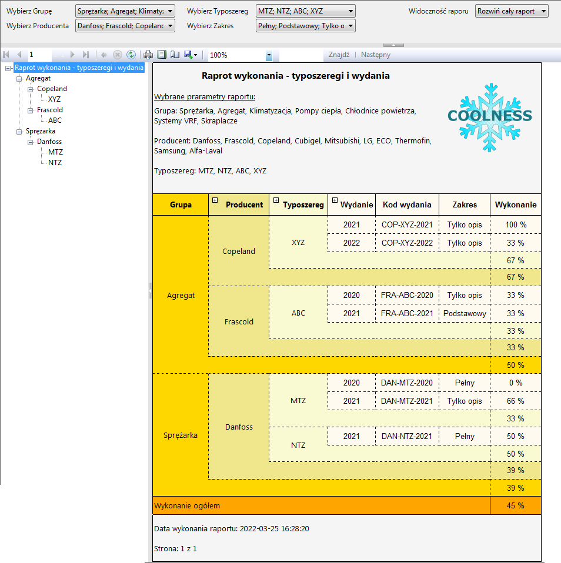

# Reports_SSRS_base_TechnicalCatalogManagement

Projekt: Reports SSRS base TechnicalCatalogManagement

Raporty do bazy danych TechnicalCatalogManagement wykonane w SQL Server Reporting Services (SSRS) za pomocą Visual Studio 2017

Sparametryzowane i dynamiczne raporty oparte na danych z widoków w repozytorium "Technical_Catalog_Management".

Umożliwiają wygodny i prosty w obsłudze przegląd tabel.

Raporty oparte na danych przykładowych wygenerowanych podczas tworzenia bazy na podstawie pliku "1. Baza danych TechnicalCatalogManagement" z repozytorium "Technical_Catalog_Management".

Zaimplementowane raporty:

-Raport wykonania typoszeregi i wydania

Raport_in_SSMS:

Raport_in_SSRS:

-Raport zadań - wydania: Work in progress